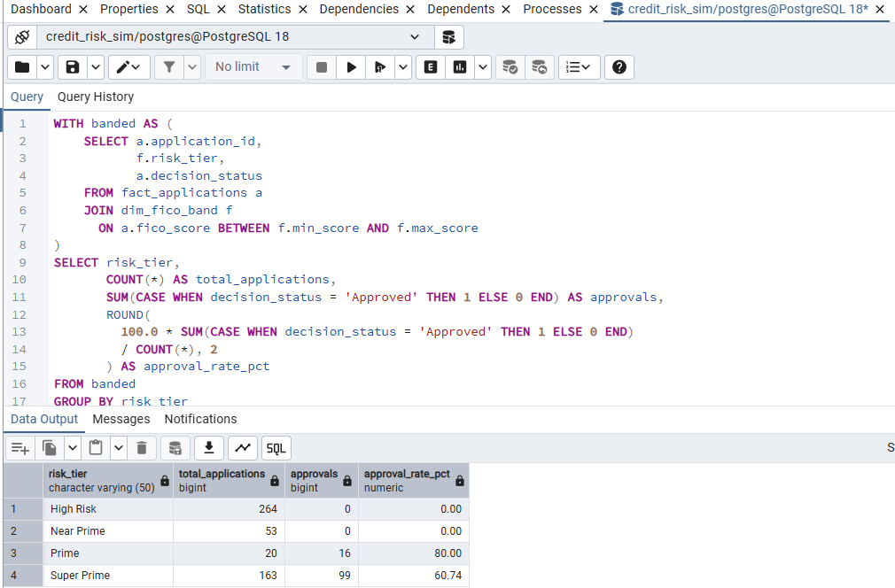
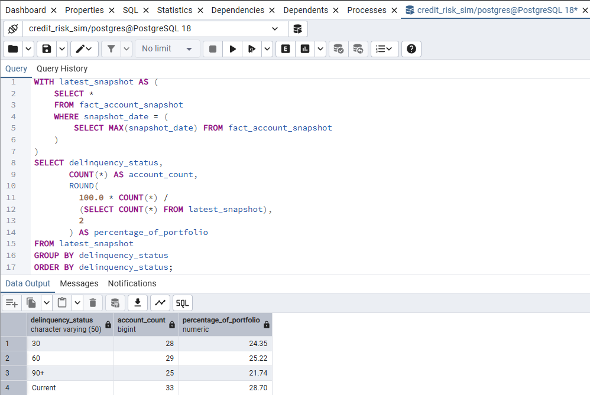

# Credit Decision Engine & Portfolio Risk Monitoring Framework

SQL-based credit decision and portfolio risk monitoring framework. Includes normalized schema design, synthetic portfolio generation, rule-based underwriting, delinquency lifecycle tracking, fraud anomaly detection, and expected loss calculation using reproducible SQL.

---

## 1. Business Objective

Design and implement a credit lifecycle system that supports:

- Underwriting decision evaluation  
- Risk tier segmentation  
- Portfolio exposure monitoring  
- Delinquency roll-rate tracking  
- Fraud anomaly detection  
- Expected loss estimation  
- Audit-traceable rule governance  

All logic is externalized and reproducible to reflect regulated analytics standards.

---

## 2. Data Model Overview

### Fact Tables

**fact_applications**
- application_id (PK)  
- applicant_id (FK)  
- application_date  
- requested_amount  
- fico_score  
- income  
- dti_ratio  
- decision_status  
- decision_reason_code  

**fact_accounts**
- account_id (PK)  
- applicant_id (FK)  
- origination_date  
- credit_limit  
- current_balance  
- utilization_ratio  

**fact_account_snapshot**
- snapshot_id (PK)  
- account_id (FK)  
- snapshot_date  
- delinquency_status  
- days_past_due  
- balance  

**fact_transactions**
- transaction_id (PK)  
- account_id (FK)  
- transaction_date  
- amount  
- merchant_category  
- fraud_flag  

---

### Dimension Tables

**dim_applicant**
- applicant_id (PK)  
- state  
- employment_type  
- tenure_years  
- income_band  

**dim_fico_band**
- fico_band_id (PK)  
- min_score  
- max_score  
- risk_tier  

**dim_decision_rules**
- rule_id  
- min_fico  
- max_fico  
- max_dti  
- decision_outcome  
- rule_version  
- effective_date  

---

## 3. Rule-Based Underwriting Evaluation

Decision logic is externalized through a versioned rule table.

```sql
SELECT a.application_id,
       r.decision_outcome
FROM fact_applications a
JOIN dim_decision_rules r
  ON a.fico_score BETWEEN r.min_fico AND r.max_fico
 AND a.dti_ratio <= r.max_dti;
```

Policy configuration example:

- FICO < 580 → Declined  
- 580–640 with DTI > 45% → Refer  
- FICO > 680 with DTI < 40% → Approved  

---

## 4. Portfolio Analytics Layer

### Approval Rate by Risk Tier

```sql
WITH banded AS (
    SELECT a.application_id,
           f.risk_tier,
           a.decision_status
    FROM fact_applications a
    JOIN dim_fico_band f
      ON a.fico_score BETWEEN f.min_score AND f.max_score
)
SELECT risk_tier,
       COUNT(*) AS total_applications,
       SUM(CASE WHEN decision_status = 'Approved' THEN 1 ELSE 0 END) AS approvals,
       ROUND(
         100.0 * SUM(CASE WHEN decision_status = 'Approved' THEN 1 ELSE 0 END)
         / COUNT(*), 2
       ) AS approval_rate_pct
FROM banded
GROUP BY risk_tier
ORDER BY risk_tier;
```

---

### Delinquency Roll Analysis

```sql
SELECT account_id,
       snapshot_date,
       delinquency_status,
       LAG(delinquency_status)
           OVER (PARTITION BY account_id ORDER BY snapshot_date) AS prior_status
FROM fact_account_snapshot;
```

---

### Fraud Anomaly Detection

```sql
SELECT account_id,
       transaction_date,
       amount,
       AVG(amount) OVER (
           PARTITION BY account_id
           ORDER BY transaction_date
           ROWS BETWEEN 30 PRECEDING AND CURRENT ROW
       ) AS rolling_avg,
       STDDEV(amount) OVER (
           PARTITION BY account_id
           ORDER BY transaction_date
           ROWS BETWEEN 30 PRECEDING AND CURRENT ROW
       ) AS rolling_stddev,
       CASE 
           WHEN amount >
                AVG(amount) OVER (
                    PARTITION BY account_id
                    ORDER BY transaction_date
                    ROWS BETWEEN 30 PRECEDING AND CURRENT ROW
                )
                + 3 * STDDEV(amount) OVER (
                    PARTITION BY account_id
                    ORDER BY transaction_date
                    ROWS BETWEEN 30 PRECEDING AND CURRENT ROW
                )
           THEN 1 ELSE 0
       END AS anomaly_flag
FROM fact_transactions;
```

---

## 5. Portfolio Risk Metrics

Supported KPI calculations:

- Total Exposure (EAD)  
- Utilization by Risk Tier  
- 30/60/90+ Delinquency Distribution  
- Roll-Rate Migration  
- Fraud Alert Volume  
- Approval Rate Stability  
- Expected Loss (PD × LGD × EAD)  

Example expected loss calculation:

```sql
SELECT account_id,
       current_balance AS ead,
       pd_rate,
       lgd_rate,
       current_balance * pd_rate * lgd_rate AS expected_loss
FROM portfolio_risk_view;
```

---

## 6. Governance Structure

- Rule tables stored separately from application logic  
- Versioned decision policy  
- Segmented risk reporting  
- Reproducible SQL transformations  
- Explicit decision reason codes  
- Lifecycle-based portfolio monitoring  

---

## 7. Repository Structure

```
/sql
/diagrams
/dashboard
README.md
```

---

## 8. Technologies

- PostgreSQL  
- Window Functions  
- Risk Segmentation Logic  
- Statistical Threshold Monitoring  
- Synthetic Data Generation  

---

## 9. Sample Output

### Approval Rate by Risk Tier


### Delinquency Distribution (Latest Snapshot)
